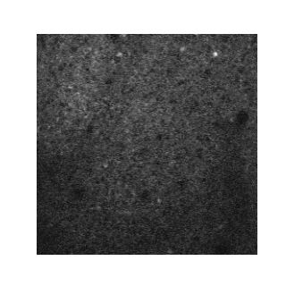
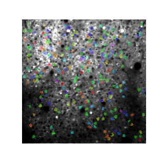

# Concepts

## Multiphoton Calcium Imaging

Over the past two decades, in vivo two-photon laser-scanning imaging of calcium signals
has evolved into a mainstream modality for neurophysiology experiments to record
population activity in intact neural circuits. The tools for signal acquisition and
analysis continue to evolve but common patterns and elements of standardization have
emerged.

The preprocessing pipeline for two-photon laser-scanning microscopy includes motion
correction (rigid or non-rigid), cell segmentation, and calcium event extraction
(sometimes described as "deconvolution" or "spike inference"). Some include raster
artifact correction, cropping and stitching operations.

<figure markdown>
  {: style="height:250px"}
  {: style="height:250px"}
  {: style="height:250px"}
  {: style="height:250px"}
  <figcaption>
    Left to right: Raw scans, Motion corrected scans, Cell segmentation, Calcium events
  </figcaption>
</figure>

For a long time, most labs developed custom processing pipelines, sharing them with
others as academic open-source projects. This has changed recently with the emerging of
a few leaders as the standardization candidates for the initial preprocessing.

- [CaImAn](https://github.com/flatironinstitute/CaImAn) (Originally developed by Andrea
  Giovannucci, current support by FlatIron Institute: Eftychios A. Pnevmatikakis,
  Johannes Friedrich)
- [Suite2p](https://github.com/MouseLand/suite2p) (Carsen Stringer and Marius Pachitariu
  at Janelia), 200+ users, active support
- [EXTRACT](https://github.com/schnitzer-lab/EXTRACT-public) (Hakan Inan et al. 2017,
  2021).

Element Calcium Imaging encapsulates these packages to ease the management of data and
its analysis.

## Acquisition tools

### Hardware

The primary acquisition systems are:

- Sutter
- Thorlabs
- Bruker
- Neurolabware

We do not include Miniscopes in these estimates. In, all there are perhaps on the order
of 3000 two-photon setups globally but their processing needs may need to be further
segmented.

### Software

- Vidrio [ScanImage](https://docs.scanimage.org/)
- Thorlabs ThorImageLS
- Scanbox
- Nikon NIS-Elements
- Bruker Prairie View
